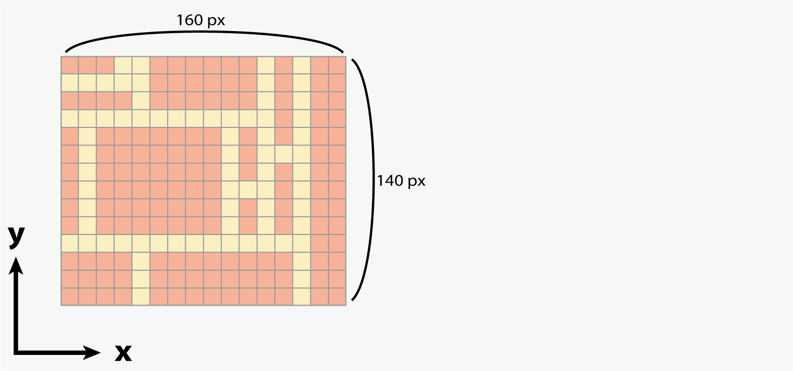

This markdown file is a simple instruction on using the `mpl_px_layout` library.  The `mpl_px_layout` is having only one function called `make_fixed_pixel_size_axes`.  And you can generate a figure with a few Axes inside by specifying each argument.
Since you can see the explanation of each argument by reading the docstring of the function, here, I provide the step of making `ax_w_px`, `ax_h_px`, `ax_w_margin_px`, and `ax_h_margin_px` arguments from the objective figure you have in your mind.

## Step1: Design the figure you want
First, you need to design the figure you want to visualise.  Draw the layout in your mind on a piece of paper, looking out that you will specify its size in pixels later.  In the following figure, the red boxes represent each Axes object, and the yellow areas are margins.  I omitted the margins from the edge of the figure to the Axes objects for clarity.




## Step2: Set the base point of each axe
Second, you have to set the base point to give indexes to each Axes object.  Scan along the x-axis and y-axis as shown in the figure below, locating the position where the number of Axes objects is the largest.


↑ Scan along each line.


↑ Find where the most Axes objects are lined up for each axis.

After finding the candidates, pick one of them as a base point for indexing.


## Step3: Give indexes to each Axes object
Third, you need to give indexes to each Axes object based on the lines defined in Step2.  Any indexing strategy is acceptable as long as it makes sense as a whole, but in the case of complex figures, it is recommended to begin with the indexing along the base point lines, then fill in the rest by interpolation.


↑ Give indexes to the Axes along the base point lines.


↑ Fill in the rest based on these indexes.

Once you have finished indexing all the Axes in the figure, it is helpful to create a table that maps Axes objects to indexes for subsequent steps.


## Step4: Take note of the position occupied by Axes
Fourth, take note of the position occupied by each Axes object and fill them in the table created in the previous step.  In the following figure, for each cell in the table, red text indicates the y-axis and blue text indicates the x-axis.


## Step5: Get four arguments
Lastly, you can get the four objective arguments by calculating the width and height of Axes as `ax_w_px` and `ax_h_px`, and of margins between them as `ax_w_margin_px` and `ax_h_margin_px`.  Note that margins can be minus values if needed.

 - Calculate the width of the Axes and margins.

    

    

    

 - Calculate the height of the Axes and margins.

    

    

    


In fact, specifying the arguments as follows will give the same figure.
You can try different examples on [demo.ipynb](/demo.ipynb) as well.

```
ax_list, fig = make_fixed_pixel_size_axes(
    fig_dpi=100,
    ax_w_px=[[40, 80, 0, 0, 0], [10, 70, 10, 10, 20], [40, 60, 10, 10, 0], [30, 0, 0, 0, 0]],
    ax_h_px=[[30, 60, 10, 10], [30, 60, 30, 0], [0, 20, 30, 0], [0, 40, 50, 0], [0, 140, 0, 0]],
    ax_w_margin_px=[[10, 0, 0, 0], [10, 10, 10, 10], [10, -10, 10, 0], [0, 0, 0, 0]],
    ax_h_margin_px=[[10, 10, 10], [10, 10, 0], [40, 10, 0], [40, 10, 0], [0, 0, 0]],
    off_index=[],
    preview=True,
    verbose=False
)
```


